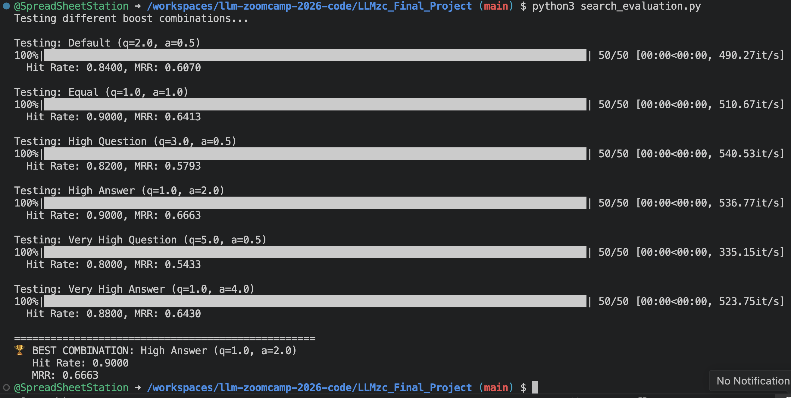
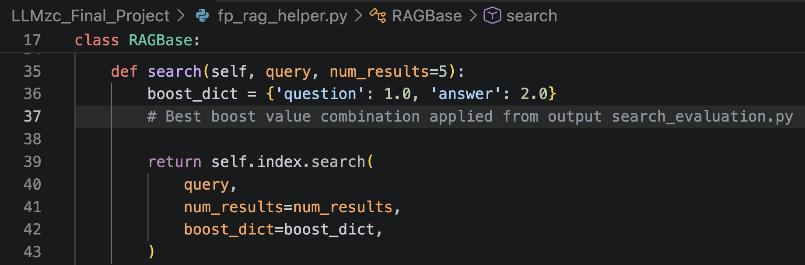
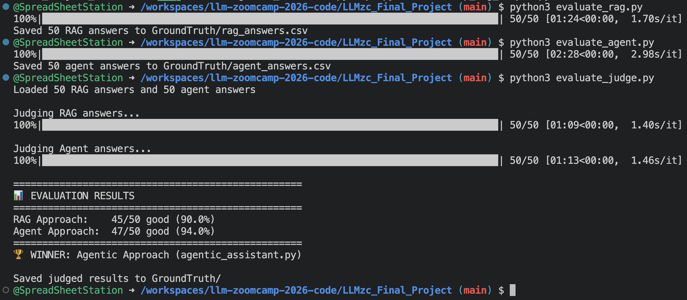
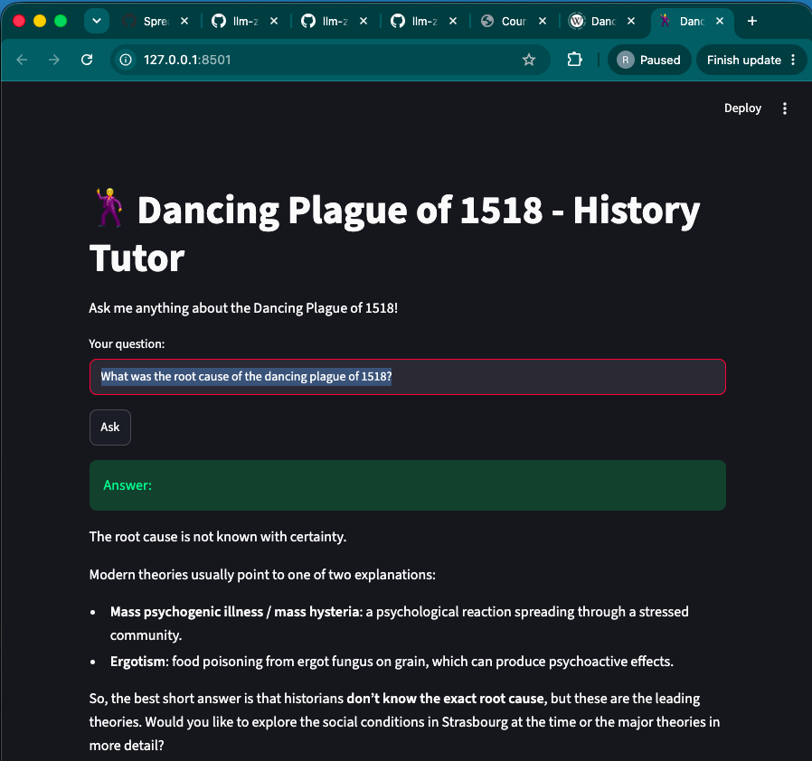
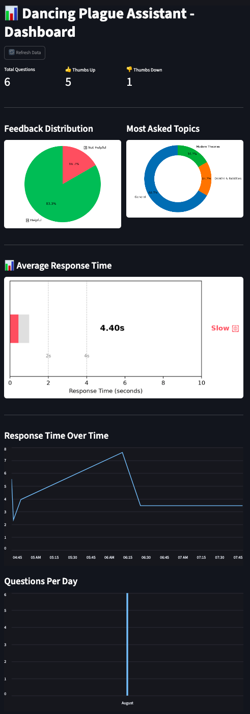

# 📊 Evaluation Criteria Check (For Reviewers)

This section was especially made for Reviewers; and maps directly to the [project.md evaluation criteria](https://github.com/DataTalksClub/llm-zoomcamp/blob/main/project.md#evaluation-criteria) to make scoring easy.

---

### 1. Problem Description (2/2 pts)

**What problem does this project solve?**

Students often have questions about the Dancing Plague of 1518 but struggle to find accurate answers quickly. This project builds a specialized AI assistant that retrieves information from a curated knowledge base and answers questions in natural language.

**Repository relevance:**
- The problem is clearly described in this README under Problem Statement
- The dataset is included in `DataSource/qa_knowledge_base.csv`
- The code directly solves the described problem

---

### 2. Retrieval Flow (2/2 pts)

**Does the project use both a knowledge base and an LLM?**

Yes. The flow is:

1. User asks a question
2. The agent searches the FAQ knowledge base (minsearch)
3. Retrieved context is sent to the LLM (OpenAI)
4. The LLM generates a grounded answer

**Repository relevance:**
- Knowledge base: `DataSource/qa_knowledge_base.csv`
- Search: `fp_ingest.py` builds the minsearch index
- LLM: `agentic_assistant.py` uses OpenAI
- Full flow: `streamlit_app.py` connects everything

---

### 3. Retrieval Evaluation (2/2 pts)

**Multiple retrieval approaches were evaluated, and the best one was used.**
 

Boost combinations tested on 50 ground truth questions:

| Configuration | Hit Rate | MRR |
|---------------|----------|-----|
| Default (q=2.0, a=0.5) | 0.8400 | 0.6070 |
| Equal (q=1.0, a=1.0) | 0.9000 | 0.6413 |
| High Question (q=3.0, a=0.5) | 0.8200 | 0.5793 |
| **High Answer (q=1.0, a=2.0)** | **0.9000** | **0.6663** |
| Very High Question (q=5.0, a=0.5) | 0.8000 | 0.5433 |
| Very High Answer (q=1.0, a=4.0) | 0.8800 | 0.6430 |

**Winner:** `question=1.0, answer=2.0` → used in `fp_rag_helper.py`
 

**Repository relevance:**
- Ground truth: `GroundTruth/my_ground_truth.csv`
- Evaluation script: `search_evaluation.py`
- Best configuration is used in `fp_rag_helper.py`

---

### 4. LLM Evaluation (2/2 pts)

**Two approaches were evaluated, and the best one was used.**
 

| Approach | Good Answers | Score |
|----------|--------------|-------|
| Standard RAG (`fp_rag_helper.py`) | 45/50 | 90.0% |
| **Agentic RAG (`agentic_assistant.py`)** | **47/50** | **94.0%** |

**Winner:** Agentic RAG → used in `streamlit_app.py`

**Repository relevance:**
- RAG answers: `GroundTruth/rag_answers.csv`
- Agent answers: `GroundTruth/agent_answers.csv`
- Judged results: `GroundTruth/rag_judged.csv` and `GroundTruth/agent_judged.csv`
- Judge script: `evaluate_judge.py`

---

### 5. Interface (2/2 pts)

**A web UI is provided with a chat interface.**
A demo video of the UI & Dashboard can be found here https://youtu.be/1WOQJ6EYvTo
 

- **Streamlit app**: `streamlit_app.py` (http://localhost:8501)
- Users type questions and receive answers
- Thumbs up/down buttons for feedback
- Feedback is saved to `feedback.csv`

**Repository relevance:**
- Main UI: `streamlit_app.py`
- Dashboard UI: `dashboard.py`

**Bonus:**
Streamlit CLI is also available for quick-tests by running [agentic_assistant.py](./Images/running_agenticAssistant_CLI.png)

---

### 6. Ingestion Pipeline (1/2 pts)

**Semi-automated ingestion with a Python script.**

- `fp_ingest.py` loads the CSV and builds the search index
- Run manually when the dataset changes

To get 2/2, an orchestration tool (Kestra, dlt) would be needed.

---

### 7. Monitoring (2/2 pts)

**User feedback is collected AND there is a dashboard with at least 5 charts.**
A demo video of the UI & Dashboard can be found here https://youtu.be/1WOQJ6EYvTo
 

- ✅ User feedback: Thumbs up/down buttons in `streamlit_app.py`
- ✅ Dashboard: `dashboard.py` with **5 charts**:
  1. Feedback Distribution (pie chart)
  2. Most Asked Topics (donut chart)
  3. Average Response Time (gauge chart)
  4. Response Time Over Time (line chart)
  5. Questions Per Day (bar chart)

**Repository relevance:**
- Feedback saving: `save_feedback()` in `streamlit_app.py`
- Dashboard: `dashboard.py`
- Data: `feedback.csv` (auto-created)

---

### 8. Containerization (1/2 pts)

**Dockerfile is provided for the main application OR there's a docker-compose for the dependencies only.**

- ✅ `Dockerfile` builds the container
- ✅ `start.sh` starts both the app and the dashboard
- ✅ One command: `docker run -p 8501:8501 -p 8502:8502 dancing-plague-app`

**Repository relevance:**
- Container definition: `Dockerfile`
- Startup script: `start.sh`

---

### 9. Reproducibility (2/2 pts)

**Instructions are clear, the dataset is accessible, and dependency versions are specified.**

- ✅ README has clear step-by-step instructions
- ✅ Dataset: `DataSource/qa_knowledge_base.csv`
- ✅ Dependencies: `requirements.txt` with pinned versions
- ✅ API keys: `.env.example` provided
- ✅ Docker option for easy setup

**Repository relevance:**
- Instructions: This README
- Dependencies: `requirements.txt`
- Environment template: `.env.example`

---

### 10. Best Practices (2/3 pts)

The following best practices were implemented:

- [x] **User query rewriting** – The agent reformulates queries for better search results (built into the agent's search behavior)
- [x] **Document re-ranking** – Search results are ranked by relevance using minsearch's boost mechanism
- [ ] Hybrid search – Not implemented (not needed for this small dataset)

---

### 11. Bonus points

- [ ] Deployment to the cloud – Not implemented (not needed for this small dataset)

🌟 3 extra bonus points up to the Reviewer to award

---